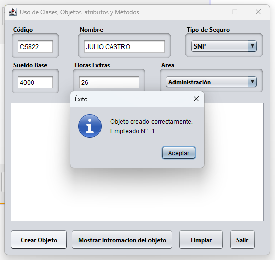
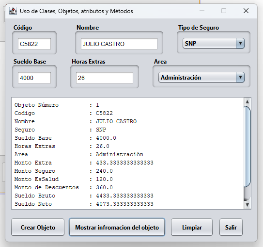
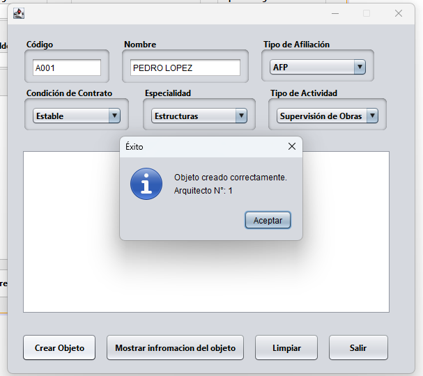
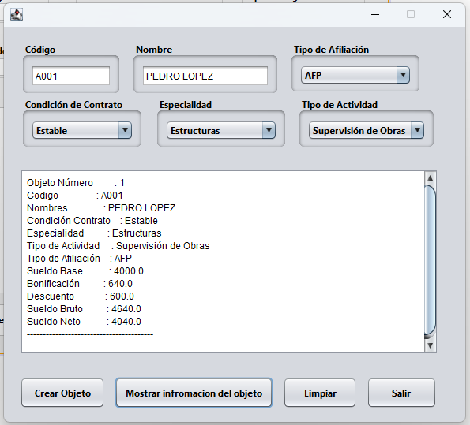
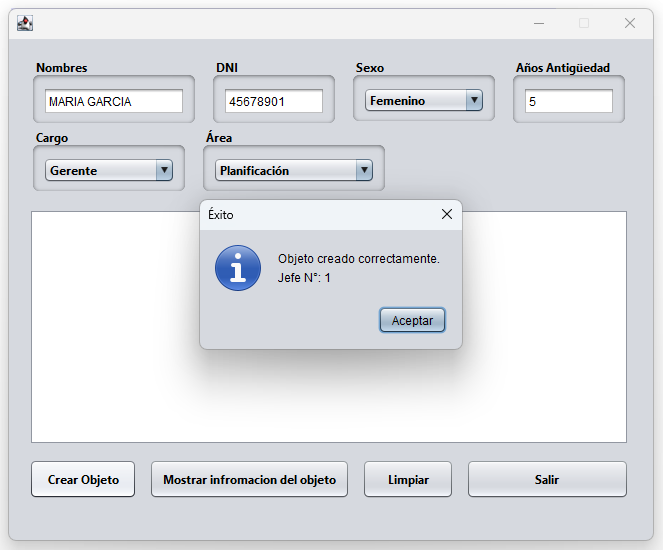
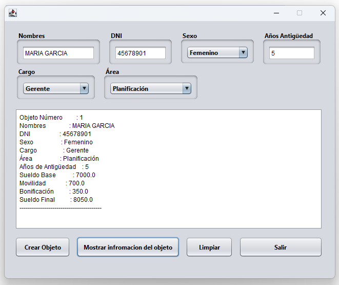

# 🏢 Lab01 — Sistema de Gestión de Empleados

> Laboratorio 01 — Programación Orientada a Objetos | UTP Lima

---

## 📝 Descripción

Aplicación de escritorio desarrollada con **Java Swing** que modela tres tipos de trabajadores de una empresa, permitiendo registrar sus datos y calcular automáticamente sueldos, descuentos y bonificaciones.

---

## 🏗️ Clases implementadas

### 👷 Empleado
- Descuentos por AFP (11%) o SNP (6%)
- Descuento por EsSalud (3%)
- Cálculo de horas extras y sueldo neto

### 📐 Arquitecto
- Sueldo base según condición de contrato y tipo de actividad
- Bonificación según especialidad — Estructuras (16%) / Recursos Hídricos (18%)
- Descuentos AFP (15%) o SNP (8%)

### 👔 Jefe
- Sueldo base según cargo y área
- Bonificación según años de antigüedad
- Movilidad según cargo
- Cálculo de sueldo final

---

## 🧠 Conceptos aplicados

| Concepto | Detalle |
|---|---|
| 🏗️ Clases y Objetos | `Empleado`, `Arquitecto`, `Jefe` instanciados desde formulario |
| 🔗 Atributos estáticos | `static` — compartidos entre todos los objetos |
| 🔒 Constantes | `static final` — valores inmutables |
| ⚙️ Métodos | `calcularSueldoBase()`, `sueldoNeto()`, `getContador()` |
| 🛡️ Encapsulamiento | Modificadores `private` / `public` |
| 🖥️ Interfaz gráfica | `JFrame`, `JPanel`, `JTextField`, `JComboBox`, `JTextArea`, `JButton` |
| 🎯 Manejo de eventos | `ActionPerformed`, `KeyTyped`, `WindowOpened` |

---

## 🖥️ Capturas de pantalla

### 👷 Empleado
| Registro | Resultado |
|---|---|
|  |  |

### 📐 Arquitecto
| Registro | Resultado |
|---|---|
|  |  |

### 👔 Jefe
| Registro | Resultado |
|---|---|
|  |  |

---

## 🚀 ¿Cómo ejecutar?

1. Abre **NetBeans IDE 29**
2. Ve a `File → Open Project` y selecciona la carpeta `Lab01_GestionEmpleados`
3. Presiona `F6` para ejecutar

---

## 🔙 Volver al índice

[← Volver al repositorio principal](../README.md)
