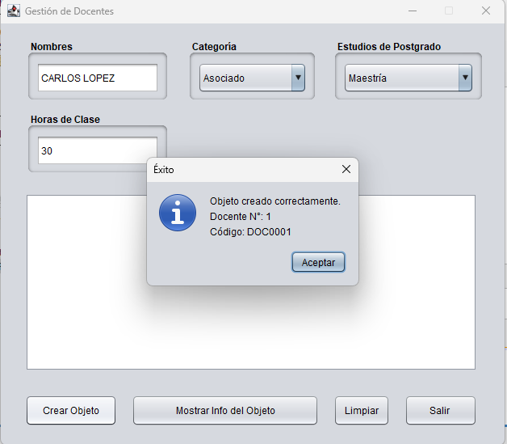
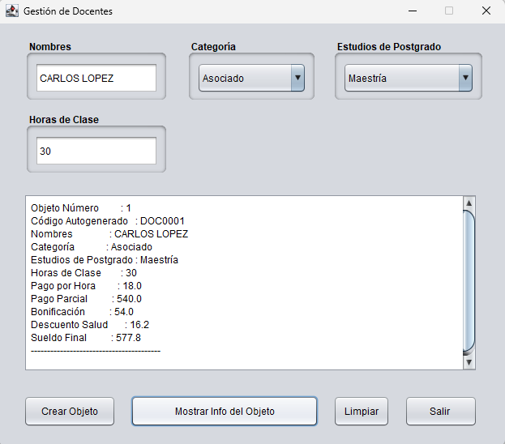
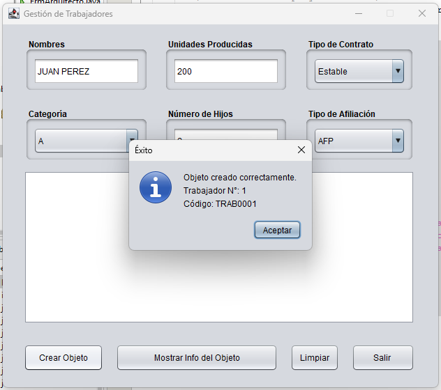
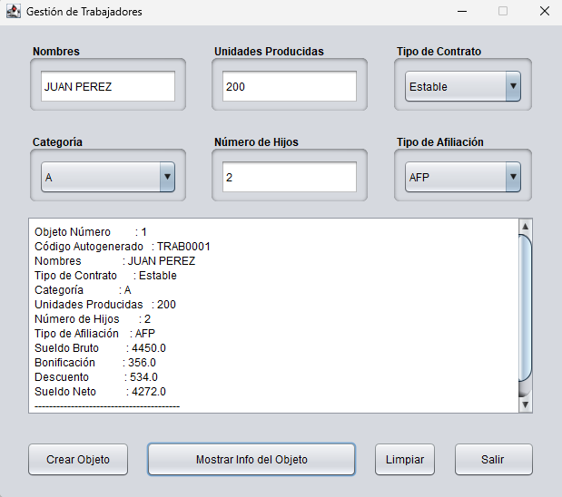

# Lab02 — Encapsulamiento, Constructores y Sobrecarga de Métodos 🔒

Aplicación de escritorio desarrollada con Java Swing como parte del
curso de Programación Orientada a Objetos (UTP).

## Descripción
Sistema que modela dos tipos de trabajadores aplicando encapsulamiento
con getters/setters y generación automática de códigos únicos.

## Clases implementadas

### Docente
- Código autogenerado con formato DOC0001, DOC0002, etc.
- Pago por hora según categoría (Principal, Asociado, Auxiliar)
- Bonificación por estudios de postgrado (Doctorado o Maestría)
- Descuento de salud del 3% sobre el pago parcial
- Cálculo de sueldo final

### Trabajador
- Código autogenerado con formato TRAB0001, TRAB0002, etc.
- Sueldo bruto según categoría y tipo de contrato
- Bonificación según unidades producidas
- Descuentos AFP (12%) o SNP (8%)
- Cálculo de sueldo neto

## Conceptos aplicados
- Encapsulamiento con modificadores `private`
- Getters y Setters
- Constructores
- Atributos estáticos y constantes (`static final`)
- Código autogenerado con `String.format()`
- Interfaz gráfica con Java Swing
- Manejo de eventos

## Tecnologías
- Java SE
- Java Swing (GUI)
- NetBeans IDE 29

## Capturas
### Docente

### Trabajador

